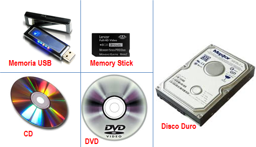

# Uniades de almacenamiento

- Bit: La unidad mínima de información en informática.
- Byte: Equivale a 8 bits.
- Kilobyte (KB): 1024 bytes.
- Megabyte (MB): 1024 kilobytes.
- Gigabyte (GB): 1024 megabytes.
- Terabyte (TB): 1024 gigabytes.
- Petabyte (PB): 1024 terabytes

# tipos

